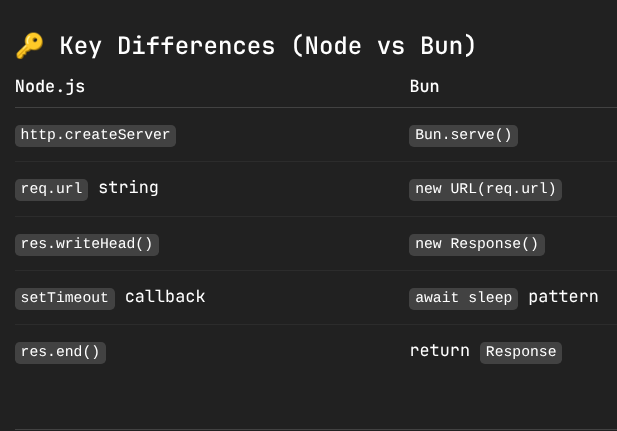

# bun

Bun does NOT expose a res object like Node/Express
That’s why you must return a Response, and that’s why Promises are needed.
 
Node code works without Promises because you control the socket
 

